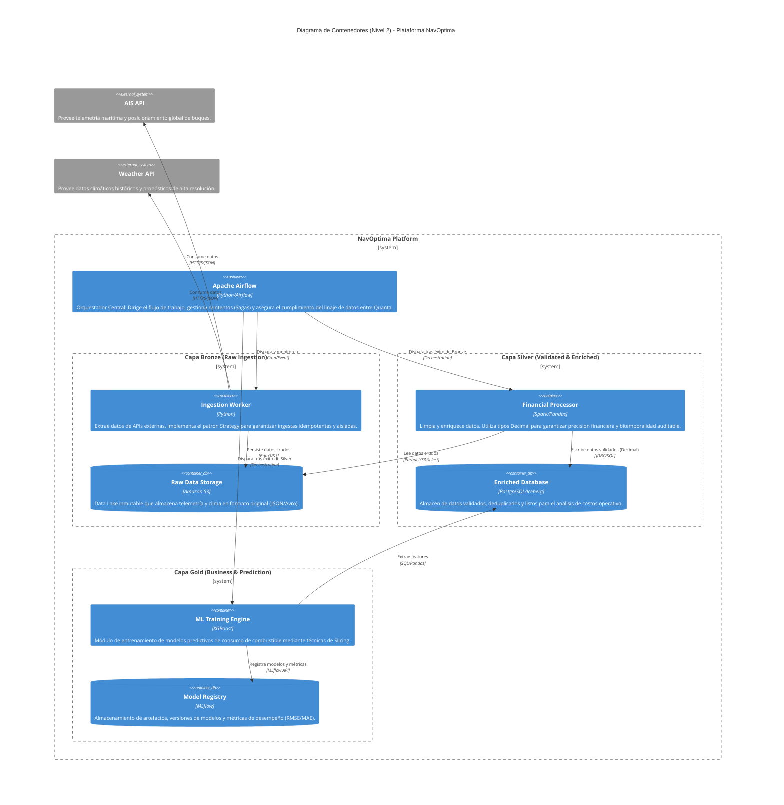
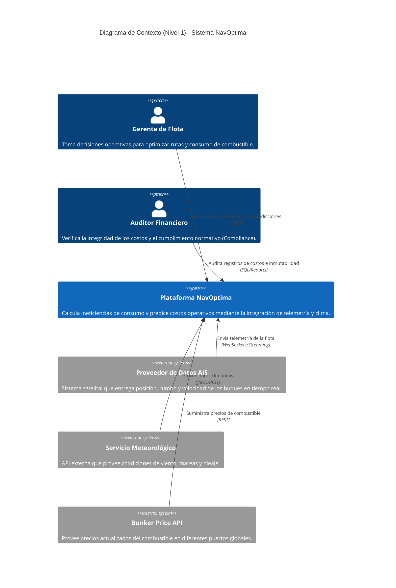

Como **Arquitecto Líder** de **NavOptima**, procederé a detallar el **Diagrama de Contexto (Nivel 1 del Modelo C4)**. Este nivel es fundamental para definir el "Sistema de Interés" y sus límites, permitiendo que tanto los interesados técnicos como los de negocio comprendan las dependencias externas y el valor generado (Richards & Ford, 2020, p. 318).

A diferencia del diagrama anterior (Contenedores), aquí tratamos a NavOptima como una "caja negra" única, enfocándonos en las interacciones con los **actores** y los **sistemas externos** que alimentan nuestra arquitectura de datos.

### 1. Diagrama de Contexto del Sistema (Mermaid.js)

---

### 2. Justificación Técnica y Cruce de Fuentes

Para este diseño de Nivel 1, he aplicado los siguientes principios arquitectónicos extraídos de las fuentes:

*   **Definición de Límites y Quanta:** Aunque NavOptima está internamente distribuido, a nivel de contexto se visualiza como un único sistema. Esto se debe a que, desde la perspectiva del usuario, el sistema actúa como una unidad con **alta cohesión funcional** (Ford et al., 2021, p. 30). El límite separa nuestra lógica de negocio de los "Productores de Datos" externos (Konieczny, 2025, p. 147).
*   **Acoplamiento Externo (Efferent Coupling):** El sistema presenta una dependencia crítica hacia sistemas externos (AIS, Clima). Según el análisis de **Trade-offs**, hemos aceptado un acoplamiento con estos proveedores para evitar el costo prohibitivo de generar telemetría propia, priorizando la **viabilidad económica** del proyecto (Richards & Ford, 2020, p. 33).
*   **Integridad Financiera y Actores:** La inclusión del "Auditor Financiero" como actor principal responde a la necesidad de **Auditabilidad** y **Trazabilidad** detallada en el dominio de arquitecturas financieras (Khraisha, 2026, p. 2276). NavOptima debe garantizar que el dato que el auditor ve sea consistente con los eventos de consumo real capturados por el sistema AIS.
*   **Ciclo de Vida de los Datos:** La interacción con el servicio AIS y Meteorológico representa la fase de **Generación** dentro del ciclo de vida de la ingeniería de datos (Reis & Housley, 2022, p. 37). NavOptima transforma estos "hechos crudos" en "valor de negocio" para el Gerente de Flota mediante la capa de **Activación** (Tranquillin et al., 2024, p. 30).

---

### 3. Bibliografía

Ford, N., Richards, M., Sadalage, P., & Dehghani, Z. (2021). *Software Architecture: The Hard Parts*. O'Reilly Media, Inc.

Khraisha, T. (2026). *Designing Financial Data Architectures* (Early Release). O'Reilly Media, Inc.

Konieczny, B. (2025). *Data Engineering Design Patterns*. O'Reilly Media, Inc.

Reis, J., & Housley, M. (2022). *Fundamentals of Data Engineering*. O'Reilly Media, Inc.

Richards, M., & Ford, N. (2020). *Fundamentals of Software Architecture*. O'Reilly Media, Inc.

Tranquillin, M., Lakshmanan, V., & Tekiner, F. (2024). *Architecting Data and Machine Learning Platforms*. O'Reilly Media, Inc.

***

**Analogía Técnica:** *El Diagrama de Contexto es como el mapa de una capitanía de puerto; no nos muestra cómo funcionan los motores de los barcos (contenedores internos), sino qué barcos entran (datos externos), quiénes son los oficiales a cargo (usuarios) y cuáles son las fronteras marítimas del puerto (límites del sistema).*