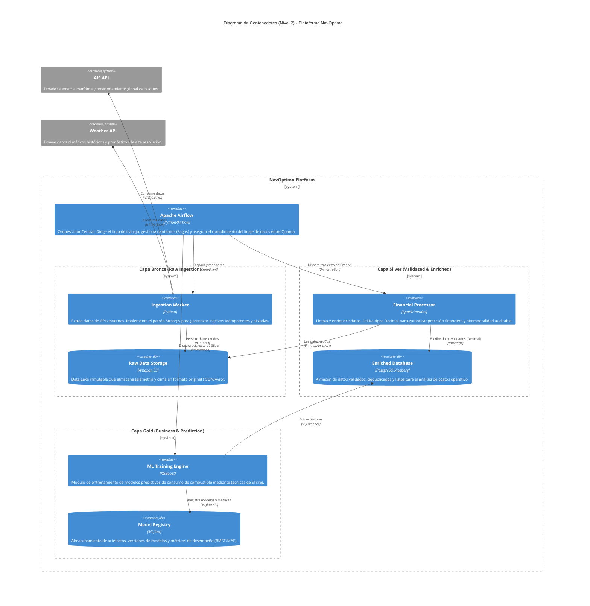

```mermaid
C4Container
    title Diagrama de Contenedores (Nivel 2) - Plataforma NavOptima

    System_Ext(ais_api, "AIS API", "Provee telemetría marítima y posicionamiento global de buques.")
    System_Ext(weather_api, "Weather API", "Provee datos climáticos históricos y pronósticos de alta resolución.")

    Boundary(nav_platform, "NavOptima Platform") {
        
        Container(airflow, "Apache Airflow", "Python/Airflow", "Orquestador Central: Dirige el flujo de trabajo, gestiona reintentos (Sagas) y asegura el cumplimiento del linaje de datos entre Quanta.")

        Boundary(bronze_layer, "Capa Bronze (Raw Ingestion)") {
            Container(ingestion_worker, "Ingestion Worker", "Python", "Extrae datos de APIs externas. Implementa el patrón Strategy para garantizar ingestas idempotentes y aisladas.")
            ContainerDb(raw_s3, "Raw Data Storage", "Amazon S3", "Data Lake inmutable que almacena telemetría y clima en formato original (JSON/Avro).")
        }

        Boundary(silver_layer, "Capa Silver (Validated & Enriched)") {
            Container(financial_processor, "Financial Processor", "Spark/Pandas", "Limpia y enriquece datos. Utiliza tipos Decimal para garantizar precisión financiera y bitemporalidad auditable.")
            ContainerDb(silver_db, "Enriched Database", "PostgreSQL/Iceberg", "Almacén de datos validados, deduplicados y listos para el análisis de costos operativo.")
        }

        Boundary(gold_layer, "Capa Gold (Business & Prediction)") {
            Container(ml_engine, "ML Training Engine", "XGBoost", "Módulo de entrenamiento de modelos predictivos de consumo de combustible mediante técnicas de Slicing.")
            ContainerDb(model_registry, "Model Registry", "MLflow", "Almacenamiento de artefactos, versiones de modelos y métricas de desempeño (RMSE/MAE).")
        }
    }

    Rel(airflow, ingestion_worker, "Dispara y monitorea", "Cron/Event")
    Rel(airflow, financial_processor, "Dispara tras éxito de Bronze", "Orchestration")
    Rel(airflow, ml_engine, "Dispara tras éxito de Silver", "Orchestration")

    Rel(ingestion_worker, ais_api, "Consume datos", "HTTPS/JSON")
    Rel(ingestion_worker, weather_api, "Consume datos", "HTTPS/JSON")
    Rel(ingestion_worker, raw_s3, "Persiste datos crudos", "Boto3/S3")

    Rel(financial_processor, raw_s3, "Lee datos crudos", "Parquet/S3 Select")
    Rel(financial_processor, silver_db, "Escribe datos validados (Decimal)", "JDBC/SQL")

    Rel(ml_engine, silver_db, "Extrae features", "SQL/Pandas")
    Rel(ml_engine, model_registry, "Registra modelos y métricas", "MLflow API")
```