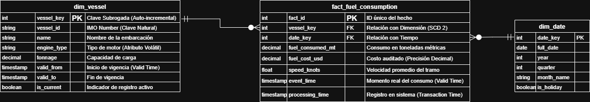

# Especificación de Diseño: Modelo Dimensional y Manejo de Historia (SCD Tipo 2)

## Introducción al Modelo Dimensional

El objetivo de este documento es especificar el diseño de un modelo de datos analítico y robusto para la capa "Gold" de la plataforma de datos de NavOptima. Este modelo está concebido específicamente para soportar dos casos de uso críticos: la inteligencia de negocio (BI) de alto rendimiento y la auditoría financiera. La arquitectura seleccionada prioriza deliberadamente la velocidad de consulta y la precisión histórica por encima de la eficiencia de almacenamiento característica de los modelos transaccionales normalizados, que están optimizados para otras finalidades.

La arquitectura de datos seleccionada se basa en un Esquema Estrella (Star Schema).

Esta decisión se alinea con los estándares de la industria para cargas de trabajo analíticas, constituyendo la estructura por excelencia para el Procesamiento Analítico en Línea (OLAP). La lógica fundamental de un esquema estrella consiste en separar los datos en una tabla de hechos central, que contiene las métricas cuantitativas del negocio (como los costos y el consumo de combustible), y un conjunto de tablas de dimensión que la rodean, las cuales proveen el contexto descriptivo (como las características de un buque o la fecha de un evento). Este enfoque es intrínsecamente más eficiente para las consultas de agregación y filtrado, en contraste con los esquemas altamente normalizados optimizados para el Procesamiento de Transacciones en Línea (OLTP), que requerirían múltiples y costosas uniones de tablas para reconstruir el mismo contexto analítico.

Esta elección se fundamenta en un principio clave del diseño de data warehouses, que busca minimizar la complejidad y el coste computacional de las consultas.

El diseño de modelos dimensionales con un esquema estrella reduce el número de uniones (joins) necesarias para las consultas, lo cual es un objetivo de diseño fundamental para los sistemas analíticos. Al pre-unir el contexto en dimensiones cohesivas, se simplifica el acceso para los usuarios y se acelera drásticamente el rendimiento.

Este diseño, por tanto, establece una base optimizada para el análisis. A continuación, se detalla el diseño del primer componente clave de este modelo: la dimensión de buques.

Este diseño, por tanto, establece una base optimizada para el análisis.

> **Figura 1:** Diseño del Esquema Estrella (Star Schema) para la Capa Gold de NavOptima. Se detalla la relación entre la tabla de hechos *fact_fuel_consumption* y las dimensiones, destacando la implementación de **SCD Tipo 2** (columnas *valid_from/to*) en *dim_vessel* para garantizar la integridad histórica y la auditoría.

A continuación, se detalla el diseño del primer componente clave de este modelo: la dimensión de buques.

## Análisis de la Dimensión de Buques (dim_vessel)

La tabla de dimensión dim_vessel es estratégicamente importante, ya que contiene todo el contexto descriptivo necesario para analizar los eventos de consumo de combustible. Sin embargo, los atributos de un buque (como su tipo de motor, su capacidad o su clasificación) no son estáticos y pueden cambiar a lo largo del tiempo. Esto presenta un desafío central: cómo asociar de manera precisa los datos de consumo con el estado específico que tenía un buque en un punto histórico determinado, garantizando que los análisis pasados sean reproducibles y correctos.

Para resolver este desafío, se implementa el patrón de Dimensión de Lenta Variación (SCD) Tipo 2. La implementación técnica de este patrón se materializa a través de tres columnas específicas en la tabla dim_vessel: valid_from, valid_to y is_current. Estas columnas trabajan en conjunto para crear un historial completo de versiones para cada buque:

* valid_from: Indica la fecha y hora a partir de la cual la versión de la fila es válida.
* valid_to: Indica la fecha y hora hasta la cual la versión fue válida. Un valor nulo o una fecha muy lejana (ej. '9999-12-31') señala que es la versión actual.
* is_current: Un indicador booleano (true/false) que facilita la identificación rápida de la versión actualmente activa del buque.

La justificación de negocio para esta complejidad adicional es crítica y no negociable. Considere el siguiente escenario: "Si un analista consulta el consumo de combustible de 2023, el informe debe reflejar las características del buque (ej. tipo de motor) vigentes en 2023, no las características que tiene hoy." La incapacidad de hacer cumplir este contexto histórico haría imposibles las conciliaciones financieras, invalidaría las comparaciones de rendimiento interanuales y resultaría en un fallo de auditoría inmediato.

Este método de mantener un "libro mayor histórico" (historical ledger) es una práctica fundamental para garantizar la reproducibilidad de los datos. Al mantener este registro, el data warehouse no solo sirve a las necesidades de BI y auditoría, sino que también se convierte en una fuente fiable para futuras iniciativas de ciencia de datos, permitiendo el entrenamiento y la prueba de modelos de machine learning sobre un conjunto de datos completo y versionado. El concepto se alinea con patrones de ingeniería de datos más amplios que buscan preservar el estado para permitir una reconstrucción histórica precisa.

El patrón "Stateful Merger", aunque se aplica a la actualización de conjuntos de datos, comparte un principio fundamental con el SCD Tipo 2: la creación de datos versionados. Al mantener un estado histórico, se permite la reconstrucción precisa de los datos en cualquier punto del tiempo, lo cual es esencial para procesos como el "backfilling" (relleno de datos históricos) o la auditoría.

Así, la implementación de SCD Tipo 2 no solo almacena los atributos de los buques, sino que preserva el contexto exacto de cada transacción a lo largo de su ciclo de vida, un pilar para la confianza en los datos. El siguiente paso es asegurar que esta historia pueda ser referenciada de forma inequívoca desde la tabla de hechos.

## Integridad Referencial y Claves Subrogadas

La elección de la clave primaria en un modelo dimensional es una decisión de diseño crítica, especialmente cuando se gestiona el historial de datos como en la dimensión dim_vessel. Es fundamental garantizar que las relaciones entre las métricas de negocio y su contexto descriptivo permanezcan estables e inequívocas a lo largo del tiempo, incluso cuando el contexto cambia.

Para lograrlo, se ha tomado la decisión estratégica de utilizar una Clave Subrogada (Surrogate Key), vessel_sk, como clave primaria de la tabla dim_vessel. Esta clave es un entero secuencial, generado y gestionado exclusivamente dentro del data warehouse, sin ningún significado en el mundo real. Se contrasta directamente con la clave natural vessel_id (el número IMO del buque), que identifica un buque físico de manera única. La distinción es crucial:

* Clave Natural (vessel_id): Identifica al buque físico. Este valor es el mismo en múltiples filas de dim_vessel si el buque ha sufrido cambios a lo largo del tiempo.
* Clave Subrogada (vessel_sk): Identifica de forma única una versión histórica específica de ese buque. Cada fila en dim_vessel, que representa un estado del buque en un período de tiempo, tiene un vessel_sk único.

El uso de vessel_sk como clave foránea en la tabla fact_fuel_consumption es el mecanismo que garantiza la integridad referencial del modelo. Permite que cada registro de consumo de combustible se vincule de manera inequívoca a la fila correcta y única en dim_vessel que representa el estado del buque en el momento exacto en que se produjo el consumo. Si se utilizara la clave natural (vessel_id) como clave primaria y foránea, sería imposible mantener la trazabilidad histórica, ya que la clave no sería única en la tabla de dimensión y la relación sería ambigua.

Esta decisión técnica es una implementación directa de la disciplina de calidad de datos. Garantiza que los datos se conformen a las expectativas del esquema para la integridad histórica, previniendo la ambigüedad que surgiría al usar una clave natural no única. De este modo, el uso de claves subrogadas asegura la inmutabilidad y la trazabilidad de los registros, convirtiendo el data warehouse en un sistema de registro auditable y fiable que previene la corrupción de informes pasados.

Con la estructura dimensional y sus relaciones firmemente establecidas, el enfoque se dirige ahora a la integridad de las métricas cuantitativas que esta estructura debe soportar.

## Tabla de Hechos (fact_fuel_consumption)

La tabla fact_fuel_consumption es el núcleo del modelo dimensional. Su función es ser el repositorio central de las métricas de negocio más críticas: los eventos de consumo y sus costos asociados. La integridad de estas métricas es de suma importancia, ya que constituyen la base para todos los informes financieros, análisis de eficiencia operativa y auditorías.

Una decisión de diseño clave para garantizar esta integridad es la elección de los tipos de datos para las métricas financieras. Las columnas fuel_cost_usd y fuel_consumed_tonnes se especifican con el tipo de dato Decimal (también conocido como Numeric en algunos sistemas).

Esta elección es deliberada y se justifica para evitar problemas de precisión inherentes a los tipos de datos de punto flotante estándar (como Float o Double). Los tipos de punto flotante almacenan los números en formato binario de una manera que puede introducir pequeños errores de redondeo. Aunque estos errores pueden parecer insignificantes en registros individuales, se acumulan al realizar operaciones de agregación a gran escala, lo que puede llevar a discrepancias significativas entre los totales del data warehouse y los sistemas financieros de origen.

Al seleccionar el tipo de dato Decimal en la capa de almacenamiento, eliminamos proactivamente esta clase de error en su origen, en lugar de intentar corregirlo de forma reactiva en pipelines de transformación posteriores. Este es un control arquitectónico para prevenir una clase específica de problemas de calidad de datos.

Los problemas de calidad de datos pueden introducirse de formas sutiles durante el procesamiento. Una de estas formas es el "redondeo de números de punto flotante" (rounding of floating numbers). Al elegir tipos de datos que garantizan la precisión decimal en el almacenamiento, se elimina el riesgo de que las transformaciones o agregaciones posteriores introduzcan errores de cálculo.

Con la precisión granular de nuestras métricas asegurada, podemos ahora sintetizar cómo este modelo dimensional, en su totalidad, ofrece un valor inigualable para la auditoría y el análisis histórico.

## Conclusión: Habilitando la Auditoría Histórica

La arquitectura especificada en este documento, que combina un Esquema Estrella, dimensiones de lenta variación (SCD Tipo 2), claves subrogadas y tipos de datos de precisión decimal, no es una selección arbitraria de tecnologías. Es una arquitectura deliberada, diseñada para un propósito fundamental: garantizar la integridad analítica y la auditabilidad completa de los datos históricos de NavOptima.

Desde la perspectiva de un Auditor Financiero, los beneficios de este diseño son claros, directos y de alto valor:

* Trazabilidad Completa: El uso de SCD Tipo 2 y claves subrogadas permite a un auditor vincular cada dólar de costo de combustible registrado en la tabla de hechos con el estado y las características exactas que tenía un buque en el momento preciso del consumo. No hay ambigüedad ni pérdida de contexto histórico.
* Reproducibilidad de Informes: El modelo garantiza que un informe financiero o de rendimiento ejecutado hoy para un período pasado (por ejemplo, el tercer trimestre de 2023) producirá exactamente los mismos resultados que si se hubiera ejecutado el último día de ese período. Esta capacidad es la piedra angular de la auditoría y la validación de datos.
* Precisión Financiera: El uso del tipo de dato Decimal para todas las métricas monetarias y cuantitativas elimina los errores de redondeo acumulativos. Esto asegura que los totales agregados en el data warehouse coincidan con una precisión perfecta con los sistemas financieros de origen, facilitando la conciliación y validando la exactitud de los informes.

En resumen, este diseño no es un mero repositorio de datos; es una máquina del tiempo analítica que faculta al auditor financiero para reconstruir y validar cada costo histórico con absoluta confianza y precisión.
